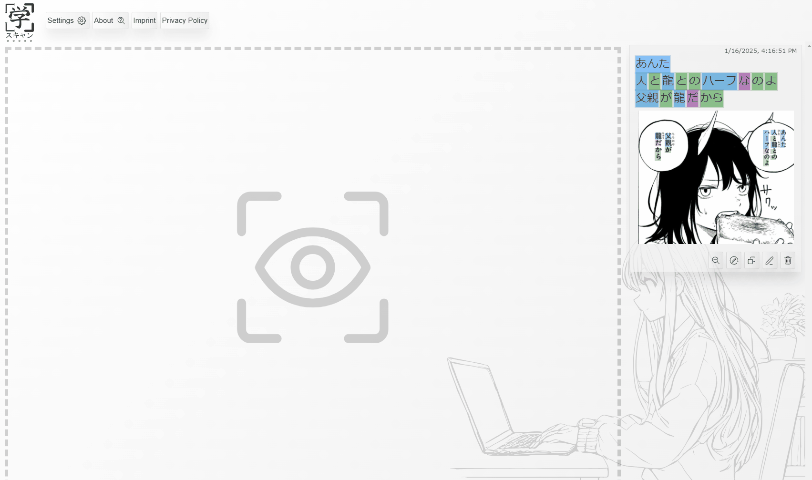
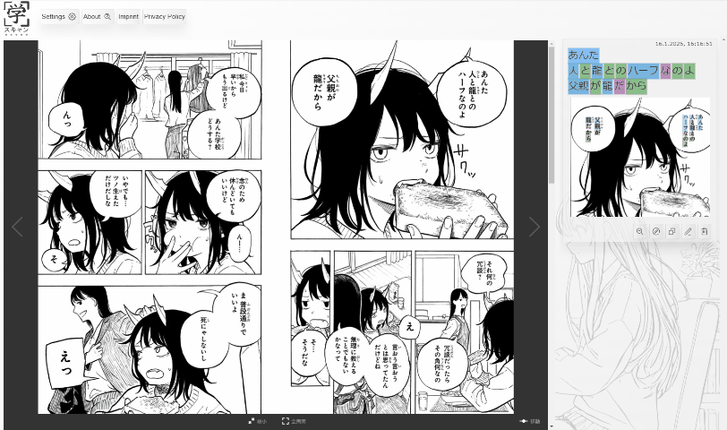
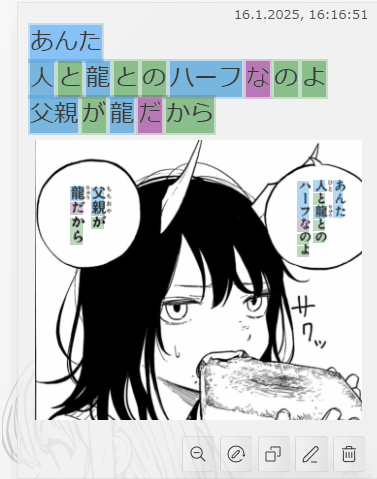

# How to Use GakuScan(学スキャン)

GakuScan is designed to provide an intuitive and efficient way to extract text from shared media using the browser's **Media Capture API**. This guide walks you through setting up and using the app effectively.

## **1. Setting Up GakuScan**

### **Google Cloud Vision API Key**
Before using GakuScan, you must set up a **Google Cloud Vision API key**. This step is required only once. Until the key is configured, GakuScan will display setup instructions.

If you want to know why this key is needed and how to obtain it, please read [this guide](google-vision.md). Additionally, it’s recommended set up a **budget** to avoid unexpected costs.

## **2. Capturing Media**

1. Go to [gakuscan.app](https://gakuscan.app).
2. Once your API key is set up, you'll see a large **capture** icon.
3. Click the capture icon to activate your browser's **Media Capture API**.
4. A dialog will appear, allowing you to share:
   - **Tab**: Ideal for analyzing content in another browser tab (e.g., web-based manga or articles).
   - **Window**: Useful for scanning specific application windows like manga readers.
   - **Screen**: Best for full-screen applications such as games.
5. Select the media source you wish to share.

## **3. Selecting an Area**

1. Once the media is mirrored in GakuScan, navigate to the part of the image or video you want to scan.
2. Click and drag on the shared media to create a rectangular selection.
3. Release the mouse to finalize the selection.

## **4. Scanning the Selected Area**

1. GakuScan will process the selected area and extract the text.
   - Only the selected area is sent to **Google Cloud Vision** for recognition.
   - Everything else, including the shared frame, is stored **locally in your browser** for reference.
2. The extracted text, along with the corresponding image, is displayed either **to the right** or **below** (in portrait mode).
3. The app highlights the grammatical structure of the text to help with comprehension.
   - Hover over words to see their **dictionary form** and **grammatical role**. 

## **5. Using the Extracted Text**

- Click the  button to clean up artifacts, remove unnecessary text (e.g., character names, sound effects), or make adjustments.
- For vocabulary lookup, use a **popup dictionary** like [**Yomitan**](https://yomitan.wiki/) alongside GakuScan.
- Click the  button to copy the extracted text to your clipboard for use in other applications.
- Click the  button to open **DeepL** with the scanned text preloaded for quick translation.

## **6. Tips for Best Results**

- **Use High-Quality Images**: Clear, legible text improves OCR accuracy.
- **Refine Selections**: While precise selections work well, selecting larger areas with more context can sometimes yield better recognition results.

Thank you for using GakuScan! 🚀